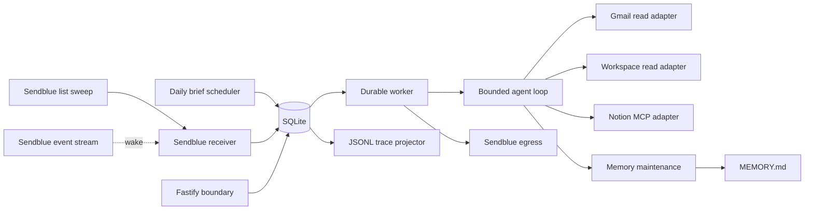

# Architecture

## Scope

This service is a private iMessage assistant for one configured sender. One Node.js 24 process polls the Sendblue Free Sandbox for inbound iMessages, runs a bounded Gemini tool loop, accesses explicitly connected Google Workspace and Notion accounts, maintains one local memory document, and sends replies from the configured Sendblue line.

The service does not support group chats, multiple assistant users, arbitrary autonomous schedules, destructive provider operations, or generic provider method execution. It supports one fixed read-only daily brief.

## Transport account model

The transport is one Sendblue Free Sandbox line. That plan sets the operating envelope:

- The line number is assigned by Sendblue and shared, so `SENDBLUE_FROM_NUMBER` identifies the line, not an owned phone number. Inbound matching therefore requires the exact sender as well as the exact line.
- Only a contact verified in Sendblue can exchange messages with the line, and that contact must open the conversation by texting the line before the assistant can send to it. Setup is verified-contact first, inbound-first.
- The sandbox delivers nothing to this service. There is no webhook endpoint, no signature to verify, and no messaging callback to register with the provider. Every inbound message is discovered by the list sweep.
- Sendblue returns no transcription for inbound audio, so voice notes cannot become user input.
- One reply is one send call. Sendblue caps message content at 18,996 characters, and the agent's final answer is bounded to the same 18,996 characters, so the send path always accepts it.

## Process topology

One process owns one long-lived `better-sqlite3` connection and these components:

The public Fastify instance serves only `/health`, the signed connection routes, the OAuth callbacks, and the Notion client metadata document. No provider posts to this service, so the public HTTP surface is not part of message transport.

When enabled, the authoritative process adds a second Fastify instance bound only to container `127.0.0.1`. It reuses that process's database handle, connection store, signed-link service, and memory store. Railway publishes only the public listener; an authenticated SSH local forward is the sole browser path to account health, new Google connection, and revision-checked `MEMORY.md` editing. The tunnel starts no second assistant runtime.

SQLite, `MEMORY.md`, and projected traces share the Railway volume. Production runs one replica because the queue, worker, and WAL database are one local durability unit.

Startup performs configuration validation, SQLite migration and integrity checks, interrupted-write recovery, interrupted-memory recovery, pending trace projection, and trace retention. Startup does not contact Sendblue, Gemini, Google Workspace, or Notion. The receiver, the daily brief scheduler, and the worker start after every configured HTTP listener is bound.

## Inbound message flow

Ingress is a poll loop, not a callback. `SendblueReceiver` owns it:

1. Read the durable single-row ingress cursor.
2. List inbound messages with `updated_at_gte` set to the cursor, minus a 60-second overlap once the cursor has completed one sweep, ordered by `updatedAt` ascending, 100 per page.
3. Page through the reported total, rejecting a response whose pagination or ordering contradicts the request.
4. Ingest each message, then advance the cursor to the highest observed `updatedAt` for the page.
5. Sleep 5 seconds, or resume immediately when the event stream signals activity.

Ingesting one message inserts the delivery, inbound message, initial trace events, and durable job in one SQLite transaction. Provider message IDs are unique, so the overlap window re-observes messages already stored and resolves them to the existing delivery instead of creating another inbound message, job, or agent run.

A message is accepted only when its line number and recipient number both equal the configured Sendblue line, its sender number and contact number both equal `USER_PHONE_NUMBER`, it is inbound, it is a one-to-one `message` with no group ID, its service is `iMessage`, and its status is `RECEIVED`. Every other message is recorded as rejected with a reason and never gets an inbound row, a job, or a tool call.

The event stream is a latency optimization only. A `message.received` event wakes the sweep early; it never carries message content into the database. When the stream is unavailable, the receiver reconnects with bounded backoff and the 5-second sweep continues to deliver every message.

Sendblue does not transcribe inbound audio. A media-only message therefore arrives with no text, is blocked without an agent run, and produces one `missing_text` failure notice. Safe message metadata records that media was present; attachment URLs are not retained.

## Durable queue

The queue holds four job types: `inbound`, `daily_brief`, `egress_send`, and `egress_reconcile`. Jobs use lease tokens and lease expirations. A claim increments its attempt count and sets one random lease token. Heartbeats, completion, requeue, failure, and shutdown checks must present that token. An expired lease can be reclaimed; the stale owner cannot commit afterward.

Only one job for a chat can run at once. Inbound sequence numbers preserve per-chat order. Internal egress jobs are capacity-exempt so a full user queue cannot prevent a committed result or failure notice from being sent.

A process stop does not release a lease while its handler may still be running. On `SIGTERM`, the configured HTTP listeners begin draining; the receiver, the daily brief scheduler, and the worker observe one shared abort signal and stop after their in-flight sweep or handler returns. SQLite stays open unless every listener drains successfully. Pending traces then project and SQLite closes. If the platform kills the process first, the lease expires and the durable ingress cursor and queue let the next process resume without losing work.

## Daily brief flow

The in-process scheduler reconciles SQLite once per minute. It creates one `daily_brief` job per Los Angeles calendar date with `available_at` set to 08:00 America/Los_Angeles. The unique `(type, subject)` key makes overlapping passes and restarts idempotent. A missing brief can catch up for two hours after 08:00; after that window, the scheduler creates the next day's job. Scheduling performs no provider request.

A daily brief run points `agent_runs.scheduled_job_id` at the claimed job instead of fabricating an inbound message. It runs through the normal bounded agent loop, memory maintenance, egress write-intent, and delivery reconciliation paths.

The production registry remains exactly eight tools. For a daily brief, `AgentLoop` filters the model definitions to `gmail.search`, `gmail.read_thread`, `google.search`, `google.read`, `notion.search`, and `notion.fetch`. The request requires one Gmail search and one batched Calendar, Drive, and Tasks search for each capable Google account. It requires one search for each capable Notion workspace. Contacts remain available on demand but are not part of the daily brief. The completion guard checks each account and product facet by the bound connection and exact safe label. With no healthy source, the service sends connection instructions without calling the model.

The handler rechecks the local date and catch-up deadline before any provider work. A daily-origin egress job carries a durable completion deadline and enabled-state requirement. Before opening a Sendblue attempt, the egress handler cancels a still-prepared stale or disabled message and records a confirmed non-write. It never cancels or repeats a write once provider dispatch may have started.

## Agent boundary and limits

The model receives:

- the assistant system policy;
- the complete bounded `MEMORY.md` document;
- bounded recent conversation history;
- safe connection labels, provider names, health states, and capabilities;
- tool definitions allowed for that run;
- normalized tool results.

The model does not receive credentials, provider SDK clients, provider wire payloads, internal connection IDs, provider account IDs, signed connection links, or raw attachment URLs.

Each run has a durable transcript and enforces these bounds:

- 120-second wall-clock deadline by default;
- six tool rounds plus a final answer;
- sixteen tool calls total;
- four tool calls in one model response;
- two provider writes;
- eight exponentially backed-off transport attempts for one Gemini request, still bounded by the whole-run deadline;
- 18,996 characters for the final iMessage response, matching the Sendblue content cap.

Internal tool names use dots. The Gemini adapter alone converts dots to underscores on the wire and maps returned calls back to the internal names. It stores each assistant wire message as opaque provider state and replays it unchanged so Gemini thought signatures survive tool rounds; core code never interprets that state.

## Production tools

The production registry contains exactly these tools:

| Tool | Class | Scope |
| --- | --- | --- |
| `gmail.search` | Read | Bounded Gmail message search |
| `gmail.read_thread` | Read | Bounded normalized thread content |
| `google.search` | Read | One 1–4 product batch across Calendar, Drive, Contacts, and Tasks |
| `google.read` | Read | One Drive file, contact, or task |
| `notion.search` | Read | Internal Notion search |
| `notion.fetch` | Read | Fetch one Notion object |
| `notion.create_page` | Write | Create one page |
| `notion.update_page` | Write | Update one page |

There are no delete, archive, move, raw request, or catch-all tools. Daily brief runs use the same registry but can execute only the six read tools; a pre-execution policy rejects Contacts search and detail arguments before a provider call.

`connections.list` and `connections.connect` are inbound control tools outside the eight-tool provider registry. `connections.list` reads current SQLite state when executed and returns only provider, safe label, health status, and capabilities. `connections.connect` accepts only `google` or `notion` and returns an opaque confirmation that infrastructure will append a link; it never returns a signed URL. Their calls and results use the normal durable agent transcript, and the model authors the final reply in the following round. Daily brief runs never receive either control tool.

Gmail is read-only. `google.search` accepts one account and a closed batch of unique product queries. `google.read` accepts only a Drive file ID, Contacts resource ID, or Tasks list-and-task ID. Calendar searches already return complete bounded event records, so Calendar has no detail-read branch. Drive content reads stream at most 64 KiB of text. Google Docs and Slides export as plain text. Google Sheets export as CSV from the first sheet and report that limitation. Unsupported binary, download-restricted, and client-side encrypted files return metadata without content.

Notion uses one hosted Streamable HTTP MCP session per selected workspace operation. Every session reads all advertised tool pages. The adapter intersects those names with the four allowlisted upstream tools and the workspace's current access. A write intent validates against the live upstream input schema before provider dispatch.

## Connections and routing

Credentials are encrypted at rest with AES-256-GCM under `CREDENTIAL_ENCRYPTION_KEY`. Safe metadata and semantic capabilities are stored separately from ciphertext. One Google connection can grant `gmail.read`, `calendar.read`, `drive.read`, `contacts.read`, and `tasks.read`. Google connections are keyed by verified OIDC subject. Notion connections are keyed by the authenticated workspace identity.

A tool can select a connection in two ways:

1. An exact safe label names one healthy, capable connection.
2. No label is supplied and exactly one healthy, capable connection exists.

Zero matches fail with a connection-required result. More than one match fails as ambiguous and asks for an exact safe label. One connection's refresh or health transition never changes another connection.

Google and Notion token refreshes use credential generations and refresh leases. A stale refresh result cannot overwrite newer credentials. A crash after refresh dispatch is treated as ambiguous because the provider may have rotated the refresh token; that connection requires browser reconnection instead of an automatic retry.

## Signed browser connection flow

The model resolves connection intent from the current raw user turn; no exact command wording is required. Account-status requests call `connections.list` and answer from its authoritative result instead of a prompt snapshot or fixed infrastructure prose. Connecting or reconnecting Google or Notion calls `connections.connect` in the first model response, before any provider tool. After its URL-free result, the model authors a bounded reply without a URL. Infrastructure validates that reply, creates the signed link outside model context, appends it, and queues the result through normal iMessage egress. Historical JSON connection actions are projected to their message text when old runs enter conversation history; they are not an executable intent channel.

The signed token contains a random identifier, provider, issue time, and expiry. SQLite binds the token hash to its purpose, trace, and optional expected connection. The browser route validates the signature and durable binding before starting PKCE OAuth. Reconnection also verifies that the returned provider identity matches the expected connection before replacing credentials.

Connection and callback routes suppress request logging, disable caching, and set a no-referrer policy so signed query values and OAuth codes do not enter routine logs or browser referrers.

## Provider writes and ambiguous acceptance

Every provider mutation follows a write-intent state machine:

1. Persist `prepared` with a canonical request fingerprint.
2. Verify the active job lease and connection credential generation.
3. Persist `attempting` before the network call.
4. Persist `succeeded`, `confirmed_failed`, or `ambiguous` after the result.

If the process stops while a write is `attempting`, startup changes it to `ambiguous`. The service never automatically repeats an ambiguous write. The related agent run blocks and reports its trace ID.

Sendblue reply sending uses the same rule. One `POST` send carries the reply, and its returned message handle is the only identifier the service keeps. If the send may have been accepted, the egress row becomes `acceptance_unknown` and the write intent becomes `ambiguous`; the service never issues a second send. A send whose acceptance is known but whose delivery is not is reconciled with bounded `GET` status polls, at most twelve within a 30-minute deadline, ending as `delivered`, `provider_failed`, or `delivery_unknown`.

## Memory

`MEMORY.md` is the only canonical long-term memory. It starts with `# Memory`, is at most 16 KiB, and cannot contain configured secrets or signed connection URLs.

After a successful agent answer, one thinking-disabled model request returns either `unchanged` or a complete replacement document. The service validates the replacement and writes it through a same-directory temporary file, file sync, atomic rename, and directory sync. It records before and after digests plus a unified diff in the trace. Memory maintenance finishes or fails closed before reply egress is prepared.

A completed run can resume this maintenance-and-reply boundary after a process stop. Maintenance and reply preparation are both durable and idempotent, so recovery does not generate a second model answer or a duplicate reply.

## Traces and replay

Trace events first enter a redacted SQLite spool with a monotonically increasing sequence. JSONL files are repairable projections of that spool. A partial or divergent file is rebuilt atomically from SQLite. Terminal traces receive a digest and become eligible for age and byte-cap retention only after export.

`pnpm trace -- <trace-id>` renders the chronology and identifies the final failure. `pnpm replay -- <trace-id>` reconstructs the captured transcript and tool outcomes in `mock_only` mode. Replay loads storage configuration only; it cannot load the credential key, decrypt connections, contact a provider, execute a tool, or update application rows.
