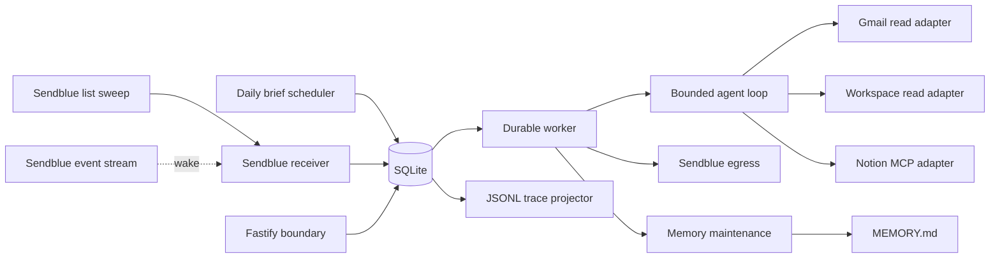

# Architecture

## Scope

This service is a private iMessage assistant for one configured sender. One Node.js 24 process polls the Sendblue Free Sandbox for inbound iMessages, runs a bounded DeepSeek tool loop, accesses explicitly connected Google Workspace and Notion accounts, maintains one local memory document, and sends replies from the configured Sendblue line.

The service does not support group chats, multiple assistant users, arbitrary autonomous schedules, destructive provider operations, or generic provider method execution. It supports one fixed read-only daily brief.

## Transport account model

The transport is one Sendblue Free Sandbox line. That plan sets the operating envelope:

- The line number is assigned by Sendblue and shared, so `SENDBLUE_FROM_NUMBER` identifies the line, not an owned phone number. Inbound matching therefore requires the exact sender as well as the exact line.
- Only a contact verified in Sendblue can exchange messages with the line, and that contact must open the conversation by texting the line before the assistant can send to it. Setup is verified-contact first, inbound-first.
- The sandbox delivers nothing to this service. There is no webhook endpoint, no signature to verify, and no messaging callback to register with the provider. Every inbound message is discovered by the list sweep.
- Sendblue returns no transcription for inbound audio, so voice notes cannot become user input.
- One reply is one send call. Sendblue caps message content at 18,996 characters, and the agent's final answer is bounded to the same 18,996 characters, so the send path always accepts it.

## Process topology

One process owns one long-lived `better-sqlite3` connection and these components:

The public Fastify instance serves only `/health`, the signed connection routes, the OAuth callbacks, and the Notion client metadata document. No provider posts to this service, so the public HTTP surface is not part of message transport.

When enabled, the authoritative process adds a second Fastify instance bound only to container `127.0.0.1`. It reuses that process's database handle, connection store, signed-link service, and memory store. Railway publishes only the public listener; an authenticated SSH local forward is the sole browser path to account health, new Google connection, and revision-checked `MEMORY.md` editing. The tunnel starts no second assistant runtime.

SQLite, `MEMORY.md`, and projected traces share the Railway volume. Production runs one replica because the queue, worker, and WAL database are one local durability unit.

Before SQLite opens, startup trims projected trace files down to a small emergency budget so a previously filled volume cannot strand the write probe in a crash loop; the spool re-projects any deleted file on demand. Startup then performs configuration validation, SQLite migration and integrity checks, interrupted-write recovery, interrupted-memory recovery, trace retention, freelist-gated SQLite compaction, and pending trace projection, in that order, because projecting first would resurrect files retention is about to delete. While running, an hourly sweep repeats projection and retention, and the WAL carries a size limit. Startup does not contact Sendblue, the configured model endpoint, Google Workspace, or Notion. The receiver, the daily brief scheduler, and the worker start after every configured HTTP listener is bound.

## Inbound message flow

Ingress is a poll loop, not a callback. `SendblueReceiver` owns it:

1. Read the durable single-row ingress cursor.
2. List inbound messages with `updated_at_gte` set to the cursor, minus a 60-second overlap once the cursor has completed one sweep, ordered by `updatedAt` ascending, 100 per page.
3. Page through the reported total, rejecting a response whose pagination or ordering contradicts the request.
4. Ingest each message, then advance the cursor to the highest observed `updatedAt` for the page.
5. Sleep 5 seconds, or resume immediately when the event stream signals activity.

Ingesting one message inserts the delivery, inbound message, initial trace events, and durable job in one SQLite transaction. Provider message IDs are unique, so the overlap window re-observes messages already stored and resolves them to the existing delivery instead of creating another inbound message, job, or agent run.

A message is accepted only when its line number and recipient number both equal the configured Sendblue line, its sender number and contact number both equal `USER_PHONE_NUMBER`, it is inbound, it is a one-to-one `message` with no group ID, its service is `iMessage`, and its status is `RECEIVED`. Every other message is recorded as rejected with a reason and never gets an inbound row, a job, or a tool call.

The event stream is a latency optimization only. A `message.received` event wakes the sweep early; it never carries message content into the database. When the stream is unavailable, the receiver reconnects with bounded backoff and the 5-second sweep continues to deliver every message.

Sendblue does not transcribe inbound audio. A media-only message therefore arrives with no text, is blocked without an agent run, and produces one `missing_text` failure notice. Safe message metadata records that media was present; attachment URLs are not retained.

## Durable queue

The queue holds five active job types: `inbound`, `daily_brief`, `egress_send`, `egress_reconcile`, and `memory_maintenance`. Jobs use lease tokens and lease expirations. A claim increments its attempt count and sets one random lease token. Heartbeats, completion, requeue, failure, and shutdown checks must present that token. An expired lease can be reclaimed; the stale owner cannot commit afterward.

Only one job for a chat runs at once. Inbound sequence numbers preserve per-chat order, and pending reply sends take priority. Memory work is created only after confirmed delivery and waits for unresolved earlier reply receipts, so older preferences cannot overwrite newer ones. Waiting memory jobs do not block newer inbound messages. Expired running jobs remain ordered by lease expiration so recovery cannot starve. Internal egress and memory jobs are capacity-exempt so a full user queue cannot strand a committed result.

A process stop does not release a lease while its handler may still be running. On `SIGTERM`, the configured HTTP listeners begin draining; the receiver, the daily brief scheduler, and the worker observe one shared abort signal and stop after their in-flight sweep or handler returns. SQLite stays open unless every listener drains successfully. Pending traces then project and SQLite closes. If the platform kills the process first, the lease expires and the durable ingress cursor and queue let the next process resume without losing work.

## Daily brief flow

The in-process scheduler reconciles SQLite once per minute. It creates one `daily_brief` job per Los Angeles calendar date with `available_at` set to 08:00 America/Los_Angeles. The unique `(type, subject)` key makes overlapping passes and restarts idempotent. A missing brief can catch up for two hours after 08:00; after that window, the scheduler creates the next day's job. Scheduling performs no provider request.

A daily brief run points `agent_runs.scheduled_job_id` at the claimed job instead of fabricating an inbound message. It uses the normal bounded agent loop, durable reply planning, egress write intent, delivery reconciliation, and post-delivery memory maintenance.

The production registry remains exactly eight tools. For a daily brief, `AgentLoop` filters the model definitions to `gmail.search`, `gmail.read_thread`, `google.search`, `google.read`, `notion.search`, and `notion.fetch`. The request requires one Gmail search and one batched Calendar, Drive, and Tasks search for each capable Google account. It requires one search for each capable Notion workspace. Contacts remain available on demand but are not part of the daily brief. The completion guard checks each account and product facet by the bound connection and exact safe label. With no healthy source, the service sends connection instructions without calling the model.

The handler rechecks the local date and catch-up deadline before any provider work. A daily-origin egress job carries a durable completion deadline and enabled-state requirement. Before opening a Sendblue attempt, the egress handler cancels a still-prepared stale or disabled message and records a confirmed non-write. It never cancels or repeats a write once provider dispatch may have started.

## Agent boundary and limits

The model receives:

- the assistant system policy;
- the complete bounded `MEMORY.md` document;
- bounded recent conversation history;
- safe connection labels, provider names, health states, and capabilities;
- tool definitions allowed for that run;
- normalized tool results.

The model does not receive credentials, provider SDK clients, provider wire payloads, internal connection IDs, provider account IDs, signed connection links, or raw attachment URLs.

Each run has a durable transcript and enforces these bounds:

- 120-second wall-clock deadline by default;
- 90-second timeout for one DeepSeek response, still bounded by the whole-run deadline;
- six tool rounds plus a final answer;
- sixteen tool calls total;
- four tool calls in one model response;
- one dispatched provider mutation per inbound request; no provider mutations in daily briefs;
- eight exponentially backed-off transport attempts for one model request, still bounded by the whole-run deadline;
- 18,996 characters for the final iMessage response, matching the Sendblue content cap.

Internal tool names use dots. The OpenAI-compatible adapter alone converts dots to underscores on the wire and maps returned calls back to the internal names. It stores each assistant wire message as opaque provider state and replays it unchanged so provider reasoning signatures survive tool rounds; core code never interprets that state.

Only the six provider reads explicitly registered as `parallel_read` execute concurrently, up to the four-call response limit. Unmarked reads, both connection-control tools, and writes remain serial by default. Parallel results are persisted back to the transcript in model call order, and individual failures remain isolated.

The production model is `deepseek-v4-flash` through DeepSeek's OpenAI-compatible chat-completions endpoint with high reasoning effort. Each assistant wire message is replayed unchanged so DeepSeek `reasoning_content` survives tool rounds. Direct deployed-model checks found that disabling thinking reduced latency but missed an explicit future-brief preference during memory maintenance, so high reasoning remains the correctness-preserving default for tool-bearing runs and memory maintenance. A run offered no tools can only word a reply, so it uses medium effort: in the request matrix, high effort spent 15–35 seconds deliberating over a greeting, a tapback, or a decline, and medium brought the tool-less median to about 3.5 seconds with the same pass rate. The classifier uses low effort with a 1536-token budget; at 768 it exhausted the budget on roughly one message in twenty. One DeepSeek response may use up to 90 seconds, still bounded by the 120-second whole-run deadline.

Reply shape rules live in the format reminder appended to every model request, not in the identity prompt. After a tool result a reply opens with a relevant emoji, as a header above a list or leading a short answer; `› ` marks only a genuine list of peer items, and outcomes, answers, and questions are plain lowercase sentences. The earlier rule that every nonblank line had to be a header or a `› ` item produced bulleted questions and bulleted one-sentence outcomes. `normalizeFinalResponse` in `src/agent/loop.ts` repairs a Markdown hyphen before `›` and, for inbound replies only, strips the prefix from a lone `› ` line so a list of one is delivered as prose; the daily brief request keeps its own instruction to use `› ` for list items, including a one-item section. Annie's tone (dry, a little put-upon, never hostile, still complete) is stated in that reminder only, keeping the identity prompt's style line neutral; the reminder still reaches every request, so tone is a wording preference, not an isolated layer. The reminder also forbids narrating tools, turns, scopes, or permissions to the user, and caps a failed provider read at one corrected retry: without the cap the model retried a dead Gmail three times in one turn. The `tests/agent.test.ts` wire-byte ceiling is a prompt-bloat tripwire, not a provider limit; it was raised from 4096 to 4352 for the tone line and to 4608 for the retry cap, each a deliberate trade recorded in the test.

Before loading history, memory, or account data, an inbound run classifies only its current raw message. This tool-free JSON request uses low reasoning and a 1536-token output cap. Its immutable, lease-fenced `agent_runs.request_scope` permits conversation with no tools, read-only access, Notion writes, or one provider's connection link. The contextual loop cannot widen those permissions. Classification shares the original run deadline and consumes one counted model request; ordinary agent and memory requests keep high reasoning. Asking whether Annie has access to, can see, or can find a named item is `read`, because answering needs a lookup. A reminder, alarm, notification, email, text, or calendar request is not a Notion write; the model may offer a list entry, and the user's answer completes it through the follow-up path. When the classifier spends its whole output budget deliberating (`finish_reason` `length`, no content) or returns something unparseable, the run does not fail: `read` is the floor, because it grants no write and no link, and the trace records `request_scope.fallback` with the reason. Before this floor, two of thirty-two matrix requests ("email alex…", a bare quoted name) ended as failure notices from `JSON.parse("")`. A conversation-scope run receives `assistantTextOnlyReminder` instead of the tool reminder: the tool reminder's "answer tool needs with silent tool calls" rule made a tool-less run return an empty message whenever the request turned out to need an account lookup or change, which surfaced as "I couldn't complete that request"; the text-only variant requires a plain-text answer that says what to send as one complete message. Tool argument validation names each violation (`/queries/0 must NOT have additional properties 'account'`) so the model corrects its next call; an opaque "does not match the schema" cost a round in one of three calendar reads.

`pnpm smoke:inbound` is the request matrix: thirty-two requests across Notion writes and reads, Google reads for every product, follow-ups to Annie's own question, plain conversation, requests outside the tool set, connection links, and a two-message burst, run against real DeepSeek with synthetic providers (`scripts/smoke/synthetic.ts`) and asserted in `scripts/smoke/cases.ts`. It reports pass rate, pass-through rate (a delivered answer that is not a failure notice), and latency together, per category and overall, with every model call timed to the last byte; `--repeat N` measures flake rate and percentiles, `--category` narrows. Production timings are a historical baseline only: successful traces are evicted and one user's traffic does not cover the matrix. A prompt or runtime change that improves latency at the cost of pass-through fails here before it ships.

An explicit write action can refer to a target established by context, but a bare acknowledgement does not authorize an old request. The one exception is bounded and mechanical: the classifier may also see Annie's own immediately preceding delivered reply, so a direct answer to a question she just asked ("Logit notes" after "tell me the page name and i'll make it", "yes" after "want me to check it off?") completes that offered action. `ConversationHistoryStore.precedingDeliveredReply` supplies it only when the previous accepted message's run produced a `reply`-purpose egress in state `delivered`, whose delivery confirmation precedes the user's send time of the current message by at most 30 minutes, with nothing else sent to the user in between; failure notices, connection links, undelivered or delivery-unknown replies, replies confirmed only after the answer was sent, and older replies contribute nothing, and earlier user messages never reach the classifier. Delivery confirmation lags the device by a poll, so the gate errs toward supplying nothing. The trace records `request_scope.preceding_reply` as `included` or `none`. The runtime does not use an English command grammar or a final-prose validator.

## Production tools

The production registry contains exactly these tools:

| Tool | Class | Scope |
| --- | --- | --- |
| `gmail.search` | Read | Bounded Gmail message search |
| `gmail.read_thread` | Read | Bounded normalized thread content |
| `google.search` | Read | One 1–4 product batch across Calendar, Drive, Contacts, and Tasks |
| `google.read` | Read | One Drive file, contact, or task |
| `notion.search` | Read | Internal Notion search |
| `notion.fetch` | Read | Fetch one Notion object |
| `notion.create_page` | Write | Create one page |
| `notion.update_page` | Write | Update one page |

There are no delete, archive, move, raw request, or catch-all tools. Daily brief runs use the same registry but can execute only the six read tools; a pre-execution policy rejects Contacts search and detail arguments before a provider call.

`connections.list` and `connections.connect` are inbound control tools outside the eight-tool provider registry. Each inbound prompt already contains one safe connection snapshot. `connections.list` reads current SQLite state when explicitly asked about connection status or when that snapshot may be stale; ordinary reads do not spend a model round rediscovering labels. `connections.connect` accepts only `google` or `notion` and returns an opaque confirmation that infrastructure will append a link; it never returns a signed URL. Their calls and results use the normal durable agent transcript, and the model authors the final reply in the following round. Daily brief runs never receive either control tool.

Gmail is read-only. A search fetches message metadata in order with at most five concurrent requests. A targeted search can hydrate zero to three top distinct threads in the same tool call, bounded to 8 KiB per thread, 24 KiB across hydration, and 120 KiB for the complete search result; a failed hydration preserves the metadata result. `google.search` accepts one account and a closed batch of unique product queries. `google.read` accepts only a Drive file ID, Contacts resource ID, or Tasks list-and-task ID. Calendar searches already return complete bounded event records, so Calendar has no detail-read branch. Drive content reads stream at most 64 KiB of text. Google Docs and Slides export as plain text. Google Sheets export as CSV from the first sheet and report that limitation. Unsupported binary, download-restricted, and client-side encrypted files return metadata without content.

Notion uses one hosted Streamable HTTP MCP session per run and selected workspace, opened on the run's first call and closed, with an explicit session `DELETE`, when the run ends on any path; a refreshed access token opens a new one. Before this, every call paid initialize, tools/list, and close, about 0.4 s of a 0.9 s call. The session reads all advertised tool pages once. The adapter intersects those names with the four allowlisted upstream tools and the workspace's current access, then validates the exact call arguments against the selected tool's live input schema. An incompatible write fails before write-intent preparation or provider dispatch. Schema changes and missing tools fail only the affected call; they do not change connection health or require OAuth reconnection. `notion.search` accepts `hydrate` 0–3: the top results' full text returns in the same tool round as pages in the exact `notion.fetch` shape, bounded to 24 KiB per page and 48 KiB in total, with a failed or oversized page simply absent and the search result never lost. In the matrix a checkbox turn went from search, fetch, update to search, update, one model round fewer.

## Connections and routing

Credentials are encrypted at rest with AES-256-GCM under `CREDENTIAL_ENCRYPTION_KEY`. Safe metadata and semantic capabilities are stored separately from ciphertext. One Google connection can grant `gmail.read`, `calendar.read`, `drive.read`, `contacts.read`, and `tasks.read`. Google connections are keyed by verified OIDC subject. Notion connections are keyed by the authenticated workspace identity.

Each provider tool call selects one connection in one of two ways:

1. An exact safe label names one healthy, capable connection.
2. No label is supplied and exactly one healthy, capable connection exists.

The adapter rejects zero matches as connection-required and multiple unlabeled matches as ambiguous. This is a per-call safety boundary, not a user-facing account picker.

For an unscoped read, the agent uses the safe connection snapshot already present in its prompt. It calls the required read tool once for each healthy capable account with its exact safe label, and those independent calls can run concurrently. The agent merges the results and deduplicates the same underlying item across accounts. It keeps distinct items that happen to share a title. The answer omits account details unless they disambiguate a result or explain a source failure. An explicit safe label scopes a read.

Writes never fan out. The agent asks for a target only when neither the request nor a preceding read establishes one. One connection's refresh or health transition never changes another connection.

Google and Notion token refreshes use credential generations and refresh leases. Concurrent reads in one process join the same in-flight refresh for a connection. A stale refresh result cannot overwrite newer credentials. A crash after refresh dispatch is treated as ambiguous because the provider may have rotated the refresh token; that connection requires browser reconnection instead of an automatic retry.

## Signed browser connection flow

The isolated current-message classifier must grant the matching provider's connection scope before `connections.connect` is available. The model then authors a bounded URL-free preface. At issuance, infrastructure checks the persisted scope again before creating a signed token or recovery message, including when an old answered tool call is resumed. Already-issued links remain idempotent. Signed URLs never enter model context.

The signed token contains a random identifier, provider, issue time, and expiry. SQLite binds the token hash to its purpose, trace, and optional expected connection. The browser route validates the signature and durable binding before starting PKCE OAuth. Reconnection also verifies that the returned provider identity matches the expected connection before replacing credentials.

Connection and callback routes suppress request logging, disable caching, and set a no-referrer policy so signed query values and OAuth codes do not enter routine logs or browser referrers.

## Provider writes and ambiguous acceptance
The model interprets the current user request, including ordinary task additions, shorthand, and relative dates. A separate current-message-only decision freezes which tools the contextual agent may use. History and provider content cannot grant new permissions. Intent interpretation and accurate wording still depend on the model; the runtime enforces the resulting tool boundary before dispatch.

`NotionToolService` owns update safety. An update uses the latest complete same-run, same-connection read of the page, whether a `notion.fetch` result or a page hydrated into a `notion.search` result; both are the same normalized shape on a succeeded tool execution, so a hydrated page is exactly as much proof as a fetched one. Its returned safe workspace label must match. A newer incomplete result cannot fall back to an older complete one. Search discovers candidates; it is not an additional authorization step, and no page-scoped proof search is injected.

An update accepts one scalar property or one bounded exact-text patch. The patch's old text must occur exactly once in the fetched page; unchanged headings or neighboring lines can disambiguate repeated tasks. Replace-all is unavailable. Full-content replacement remains available for user-requested rewrites after a complete fetch; deciding whether the user requested a rewrite belongs to the model.

An identical patch or full-content replacement returns `outcome: "unchanged"` without preparing an intent or contacting the provider. A confirmed mutation returns `outcome: "succeeded"`. These results live in the existing tool and write records, not a second action state machine. A read-grounded already-set answer or natural clarification needs no special response validator.

The loop permits one dispatched mutation per inbound request. Invalid arguments, missing source evidence, and other pre-dispatch failures return sanitized tool errors, so the model can correct its proposal without spending that budget. A later write after the budget is spent returns `write_limit`; it does not discard an earlier successful result. Multiple write calls in one response are rejected before any call in that response executes.

Every provider mutation follows a write-intent state machine:

1. Persist `prepared` with a canonical request fingerprint.
2. Verify the active job lease and connection credential generation.
3. Persist `attempting` before the network call.
4. Persist `succeeded`, `confirmed_failed`, or `ambiguous` after the result.
For Notion updates and page creation alike, a non-error MCP result is acceptance. The response body is a rendered page view, not a receipt, so its shape and `truncated` flag are not checked; a create reports page ids and URLs only when the body carries them. Only an empty envelope, a queued or wrapped `async_task`, a non-`succeeded` status, or an `error` field keeps the write acceptance-unknown. Transport failures after dispatch remain ambiguous and are never replayed. Create was covered after a production create of a titled page returned HTTP 200 and `tool_completed` yet was reported acceptance-unknown by the create-only receipt schema.

If the process stops while a write is `attempting`, startup changes it to `ambiguous`. The service never automatically repeats an ambiguous write. The related agent run blocks and reports its trace ID.
If a run completed before reply planning committed, recovery resumes idempotent reply planning from its stored response without another model call or prose revalidation. Completed inbound finalization remains reclaimable beyond the ordinary job-attempt cap. Recovery never replaces or repeats a reply whose dispatch may have begun.

Sendblue reply sending uses the same rule. One `POST` send carries the reply, and its returned message handle is the only identifier the service keeps. If the send may have been accepted, the egress row becomes `acceptance_unknown` and the write intent becomes `ambiguous`; the service never issues a second send. A send whose acceptance is known but whose delivery is not is reconciled with bounded `GET` status polls, at most twelve within a 30-minute deadline, ending as `delivered`, `provider_failed`, or `delivery_unknown`. The status codec accepts Sendblue's documented message lifecycle, not only the four values the status endpoint documents: `REGISTERED`, `PENDING`, `ACCEPTED`, and `QUEUED` are pending, `SENT` is sent, `DELIVERED` and `READ` are delivered, `ERROR` and `DECLINED` are failed. A status body that still fails validation is a transient error retried under the same poll budget; only a provider verdict ends a delivery check. Before this, a first poll about 1.5 seconds after send failed the four-value codec as a terminal protocol error and ended reconciliation as `delivery_unknown` with no retry. The rejected bodies were not retained, so their exact shape is unknown; four sampled handles later read back in the accepted nested shape as `DELIVERED`. Over three days 31 of 50 outbound messages ended `delivery_unknown`, the screenshot-confirmed ones among them visibly delivered, and because history includes an assistant turn only for a `delivered` reply, those replies were missing from Annie's context and their memory maintenance never ran.

A typing bubble shows while a turn runs. It is a provider mutation, so `TypingIndicatorService` records one `sendblue_typing_indicator` intent as `attempting` before the call and settles it after; it is never retried or replayed. It differs from a message in what an unconfirmed attempt means: a bubble that may or may not have shown harms nothing, so interrupted-write recovery marks it `ambiguous` like every open attempt but never blocks the run for it, and it never spends the run's one-mutation cap, which counts the user's provider changes only (`provider_writes` excludes every `sendblue_` kind, the reply send included). It fires as soon as the run exists, concurrently with classification, and is never awaited on the reply path; a failure is traced as `typing_indicator.failed` and otherwise ignored. Schema 10 added the kind. Read receipts need no code: Sendblue's account-level auto mark-read setting acknowledges each inbound iMessage on the line before Annie polls it.

## Conversation history

Earlier accepted user messages remain in bounded history even when their turn failed or their reply was not confirmed. Historical messages are quoted together as closed context, not emitted as live user requests; only the current inbound has the user role in the contextual loop. Assistant text enters history only after confirmed delivery. Normal replies use the delivered body; delivered connection links contribute only their stored URL-free preface. Unknown delivery does not mean the message definitely failed to arrive.

## Memory

`MEMORY.md` is the only canonical long-term memory. It starts with `# Memory`, is at most 16 KiB, and cannot contain configured secrets or signed connection URLs.

Reply preparation commits the egress row, Sendblue write intent, and send job together. Either an immediately delivered send result or a later delivery receipt enqueues `memory_maintenance` in the transaction that records delivery. The existing unique job identity prevents duplicate maintenance. Failed, ambiguous, and unconfirmed replies create no memory work. Pre-existing queued jobs independently check delivery eligibility before calling the model. A memory failure never retracts or repeats a reply.

The memory job reconstructs the user message, final response, and ordered tool outcomes from the durable run instead of carrying transient context in its payload. One configured-model request, bounded to 45 seconds and ending at least five seconds before the job lease, returns either `unchanged` or a complete replacement document. The service validates a replacement and writes it through a same-directory temporary file, file sync, atomic rename, and directory sync. It records before and after digests plus a unified diff in the trace. The job is idempotent by run ID, and startup resolves an interrupted prepared replacement before reclaiming queued work.

## Traces and replay

Trace events first enter a redacted SQLite spool with a monotonically increasing sequence. JSONL files are repairable projections of that spool. A partial or divergent file is rebuilt atomically from SQLite. Traces are debugging artifacts, not functional state: once a turn fully succeeds — completed run, memory maintenance applied, reply delivery confirmed, no failure notice, open write, or queued work — its trace is evicted immediately when the last job settles, and a clean Sendblue sweep or stream rotation evicts its trace without ever projecting a file. The overlap window re-observes the newest message on every sweep, so a duplicate observation is evicted the same way. Failures, ambiguous writes, and in-flight turns keep their traces until terminal, then age and byte-cap retention — measured in allocated disk blocks — expires them after export.

`pnpm trace -- <trace-id>` renders the chronology and identifies the final failure. `pnpm replay -- <trace-id>` reconstructs the captured transcript and tool outcomes in `mock_only` mode. Replay loads storage configuration only; it cannot load the credential key, decrypt connections, contact a provider, execute a tool, or update application rows.
